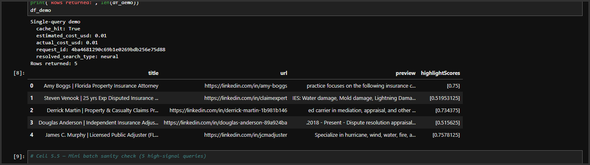
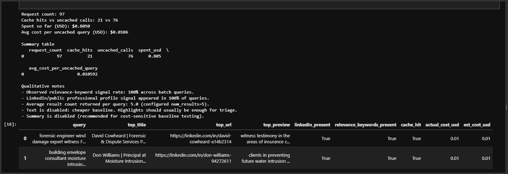
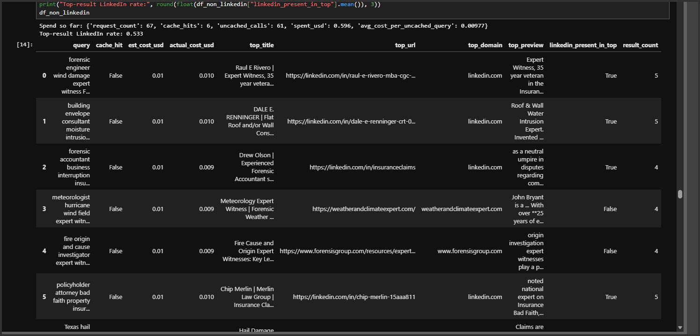
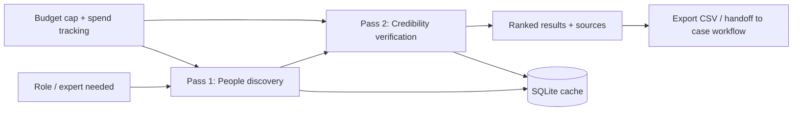

# exai-search-demo

[](https://github.com/itprodirect/exai-search-demo/actions/workflows/ci.yml)

➡️ **Start here:** [Executive Summary](#executive-summary-2-minute-read) • [Screenshots](#what-youll-see-in-this-repo) • [Integration](#integration-how-this-fits-into-real-workflows) • [Developer Quickstart](#developer-quickstart) • [Videos](#videos)

Minimal, reproducible **Exa People Search evaluation harness** for insurance / CAT-loss workflows.  
Designed to validate **value + credibility + cost predictability** before integrating into a larger claims or litigation-support system.

---

## Executive Summary (2-minute read)

This repo demonstrates a **two-pass expert discovery workflow** that is:

- **Credibility-aware** (prefers non-profile sources when possible)
- **Cost-controlled** (budget cap + spend tracking)
- **Repeatable** (SQLite cache prevents rebilling on reruns)
- **Safe-by-design** (public/professional info only)

### What it does

- **Pass 1 — People discovery:** fast candidate discovery (often LinkedIn-heavy)
- **Pass 2 — Credibility verification:** prefer **non-LinkedIn** sources (firm sites, articles, directories) when possible
- **Cost controls:** budget cap + per-call spend tracking + SQLite caching so reruns don't re-bill

### Why it matters (for attorneys / claims teams)

- Faster expert discovery + vetting with an **auditable trail of sources**
- **Predictable cost** using measured spend + projections at scale
- Designed for **public/professional info only** (no doxxing / no contact harvesting)

### Measured results (example run — your numbers may vary)

From a real run of this notebook:

- Avg **uncached** cost/query: **~$0.010592**
- Simple cost projection:
  - 100 queries: **~$1.06**
  - 1,000 queries: **~$10.59**
  - 10,000 queries: **~$105.92**

---

## What you'll see in this repo

### 1) Single-query demo (≈ $0.01)



### 2) Batch cost summary + caching



### 3) Credibility pass view (source quality matters)



---

## Integration: how this fits into real workflows

This repo is intentionally a **measured evaluation harness** you can run before integrating People Search into a larger claims / litigation-support system.



### Practical use cases (conference-relevant)

- **Build the expert bench** (engineer, meteorologist, forensic accountant, etc.) with an auditable trail of sources
- **Rebut a narrative** by prioritizing credible non-profile sources in the credibility pass
- **Control cost at scale** with measured spend + projections + caching

---

## Videos

- **This repo in ~90 seconds (recommended):** (add your Loom link here)
- **Exa People Search overview (official):** https://www.youtube.com/watch?v=YUOxsHlPyhI

---

## Repo contents

- `exa_people_search_eval.ipynb` — evaluation notebook (two-pass workflow + spend + caching)
- `scripts/run_notebook_smoke.py` — executes the notebook end-to-end (used by CI)
- `scripts/reset_cache.py` — safe cache reset utility
- `.env.example` — environment template (copy to `.env`)
- `requirements.txt` — dependencies
- `assets/` — screenshots used in this README

---

## Developer Quickstart

### 1) Create and activate a virtualenv

**Windows (PowerShell):**
```powershell
py -3.11 -m venv .venv
.\.venv\Scripts\Activate.ps1
python -m pip install --upgrade pip
pip install -r requirements.txt
```

**macOS/Linux:**
```bash
python3 -m venv .venv
source .venv/bin/activate
python -m pip install --upgrade pip
pip install -r requirements.txt
```

### 2) Configure environment

```bash
cp .env.example .env
```

Edit `.env`:
```env
EXA_API_KEY=your_real_exa_api_key
EXA_SMOKE_NO_NETWORK=0
```

### 3) No-network smoke run (no API key, no billing)

This is what CI runs:

**macOS/Linux:**
```bash
EXA_SMOKE_NO_NETWORK=1 python scripts/run_notebook_smoke.py
```

**Windows (PowerShell):**
```powershell
$env:EXA_SMOKE_NO_NETWORK="1"
python scripts\run_notebook_smoke.py
```

### 4) Real run

Open and run:
- `exa_people_search_eval.ipynb`

---

## Demo flow (live / screenshare)

Recommended order inside `exa_people_search_eval.ipynb`:

1. Single-query demo → shows ≈$0.01 + cache behavior
2. Batch discovery → shows role coverage / throughput
3. Credibility pass → prefer non-LinkedIn sources for trust
4. Cost summary + projections → predictable spend at scale
5. Recommendation / integration note → how this plugs into a case workflow

---

## Cost control philosophy

This harness is built to be **safe to test**:

- Highlights-first by default (cheap)
- Optional deeper content is gated
- Hard budget enforcement
- Cache reduces repeat costs to near-zero

---

## Guardrails / scope

- **Public/professional info only**
- No address hunting / doxxing
- No contact harvesting
- Human review required before operational use

---

## Known limitations (honest + useful)

- People discovery is often **LinkedIn-dominated** in pass 1 (expected).
- Pass 2 is designed to prioritize **credible non-profile sources** when they exist.
- Domain allow/deny lists may be necessary for production-grade source quality.

---

## License

This repo includes an MIT license in `LICENSE`.
