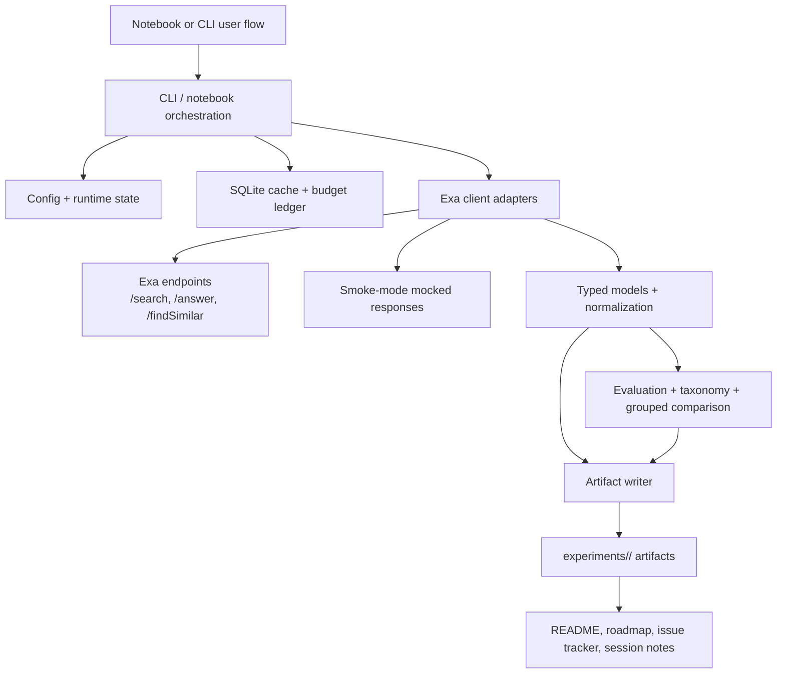

# exai-search-demo

Minimal, reproducible **Exa People Search evaluation harness** for insurance / CAT-loss workflows.

This repo is intentionally in **minimal mode**:
- one core notebook: `exa_people_search_eval.ipynb`
- one local env file: `.env` (not committed)
- one local sqlite cache: `exa_cache.sqlite` (not committed)

## Quick Navigation

- [What this repo evaluates](#what-this-repo-evaluates)
- [Feature matrix](#feature-matrix)
- [Architecture](#architecture)
- [Windows 11 setup](#windows-11-setup-python-310)
- [CLI commands](#cli-commands)
- [Experiment artifacts](#experiment-artifacts)
- [Roadmap and delivery history](#roadmap-and-delivery-history)
- [Guardrails](#guardrails)

## Feature Matrix

| Capability | Status | Primary interface | Primary artifact/output | Notes |
| --- | --- | --- | --- | --- |
| Ranked search | Done | `python -m exa_demo search` | `results.jsonl`, `summary.json` | Supports additive deep-search controls |
| Benchmark evaluation | Done | `python -m exa_demo eval` | `queries.jsonl`, `results.jsonl`, `summary.json` | Includes taxonomy scoring and grouped comparison context |
| Search-type comparison | Done | `python -m exa_demo compare-search-types` | `comparison.md` plus paired run artifacts | Compares `deep` vs `deep-reasoning` end to end |
| Cited answers | Done | `python -m exa_demo answer` | `answer.json` | Separate workflow from ranked-search evaluation |
| Structured extraction | Done | `python -m exa_demo structured-search` | `structured_output.json` | Uses `outputSchema` for schema-driven extraction |
| Seed-URL discovery | Done | `python -m exa_demo find-similar` | `find_similar.json` | Separate `/findSimilar` workflow and normalization path |
| Cache and budget ledger | Done | Notebook + CLI | `exa_cache.sqlite`, `summary.json` | Prevents re-billing on cache hits |
| Smoke CI and local tests | Done | GitHub Actions + `pytest -q` | CI runs and local test suite | Default workflow runs `pytest` and notebook smoke |

## Architecture


```mermaid
flowchart TD
    U["Notebook or CLI user flow"] --> CLI["CLI / notebook orchestration"]
    CLI --> CFG["Config + runtime state"]
    CLI --> CACHE["SQLite cache + budget ledger"]
    CLI --> CLIENT["Exa client adapters"]
    CLIENT --> EXA["Exa endpoints\n/search, /answer, /findSimilar"]
    CLIENT --> MOCK["Smoke-mode mocked responses"]
    CLIENT --> MODELS["Typed models + normalization"]
    MODELS --> EVAL["Evaluation + taxonomy + grouped comparison"]
    MODELS --> ART["Artifact writer"]
    EVAL --> ART
    ART --> EXP["experiments/<run-id>/ artifacts"]
    EXP --> DOCS["README, roadmap, issue tracker, session notes"]
```

## Repo Map

- `src/exa_demo/`: reusable package modules for client calls, models, config, evaluation, artifacts, reporting, cache, and safety
- `tests/`: CLI, client, model, artifact, script, and evaluation coverage
- `benchmarks/insurance_cat_queries.json`: named query suites used by notebook and CLI evaluation
- `experiments/`: versioned run artifacts written by workflow commands
- `docs/roadmap.md`: canonical backlog and delivery phases
- `docs/issue-tracker.md`: GitHub issue-to-roadmap mapping
- `docs/sessions/`: durable session history

## What This Repo Evaluates

- Query relevance for CAT-loss / insurance professional discovery
- Cost per uncached query and projected spend at scale
- Repeatability via sqlite caching (reruns should not re-bill)
- Safe usage posture (public/professional info only)

## Recommended Cheap Defaults

In Cell 2 (`CONFIG`), start with:
- `use_highlights=True`
- `use_text=False`
- `use_summary=False`
- `num_results=5`

Optional for before/after reporting in notebook Cell 9:
- `CONFIG["compare_to_run_id"] = "<baseline-run-id>"`
- `CONFIG["compare_base_dir"] = "experiments"`

## Windows 11 Setup (Python 3.10+)

1. Open PowerShell in this repo.
2. Create venv:

```powershell
py -3.10 -m venv .venv
```

3. Activate:

```powershell
.\.venv\Scripts\Activate.ps1
```

4. Install dependencies:

```powershell
python -m pip install --upgrade pip
pip install -r requirements.txt
```


## Installable Package and CLI

For an editable install with the CLI and dev tools available:

```powershell
pip install -e ".[dev]"
```

If your environment blocks build-dependency downloads, use:

```powershell
pip install -e ".[dev]" --no-build-isolation
```
## Configure Environment

Create `.env` from template:

```powershell
Copy-Item .env.example .env
```

Edit `.env`:

```env
EXA_API_KEY=your_real_exa_api_key
EXA_SMOKE_NO_NETWORK=0
# Optional: set a run id label for grouped budget metrics
# EXA_RUN_ID=demo-2026-03-05
```

Notes:
- `.env` is ignored by git.
- If you want no-network testing, use smoke mode (`EXA_SMOKE_NO_NETWORK=1` or runner `--mode smoke`).

## Run Notebook

Open `exa_people_search_eval.ipynb` in Jupyter Lab or VS Code and run top-to-bottom.

Notebook flow is intentionally fixed to 9 cells:
1. Install/import + env load
2. Config
3. Exa call wrapper
4. Cache wrapper (sqlite) + budget enforcement
5. Single query demo
6. Batch query suite
7. Summary + qualitative notes
8. Cost projections
9. Decision rubric + integration recommendations


## CLI Commands

```powershell
python -m exa_demo search "forensic engineer insurance expert witness" --mode smoke --json
python -m exa_demo answer "What is the Florida appraisal clause dispute process?" --mode smoke --json
python -m exa_demo structured-search "independent adjuster florida catastrophe claims" --schema-file .\path\to\structured-schema.json --mode smoke --json
python -m exa_demo find-similar "https://example.com/florida-appraisal-decision" --mode smoke --json
python -m exa_demo search "Florida property insurance appraisal clause" --type deep --additional-query "Florida appraisal dispute statute" --start-published-date 2025-01-01 --livecrawl --json
python -m exa_demo eval --mode smoke --suite forensic_and_damage_engineering --limit 5 --json
python -m exa_demo compare-search-types --mode smoke --suite forensic_and_damage_engineering --baseline-type deep --candidate-type deep-reasoning --limit 5 --json
python -m exa_demo eval --mode smoke --limit 5 --compare-to-run-id 20260310T033256Z --json
python -m exa_demo budget --run-id demo-2026-03 --json
```

The search and eval commands write the same experiments/<RUN_ID>/ artifact bundle as the notebook flow.
The `answer` command writes the same run directory and adds an `answer.json` artifact containing the cited-answer payload.
The `structured-search` command runs a schema-driven deep search and writes a `structured_output.json` artifact containing the extracted structured payload.
The `find-similar` command runs a seed-URL discovery workflow and writes a `find_similar.json` artifact containing the similar-result payload.
Deep-search-oriented request shaping is now exposed directly in the CLI with additive flags such as `--additional-query`, `--start-published-date`, `--end-published-date`, and `--livecrawl`.
Search cost estimation can also be overridden from the CLI for search-type experiments with flags such as `--deep-search-cost-1-25` and `--deep-reasoning-search-cost-1-25`.

Eval output now includes a taxonomy scorecard (relevance, credibility, actionability, confidence) and per-query failure reasons (`no_results`, `off_domain`, `low_confidence`).
Use `--compare-to-run-id` for before/after deltas across quality and failure rates when both runs share query text.
When comparison is enabled, the run also writes a human-readable `experiments/<RUN_ID>/comparison.md` report with grouped query outcomes when suite context is available.
`compare-search-types` is the end-to-end workflow for running the same suite against two search types and emitting the grouped comparison bundle in one command.
`answer` is a separate cited-answer workflow and intentionally does not reuse the ranked-search evaluation taxonomy.
`structured-search` is a separate schema-driven extraction workflow and intentionally stores the raw structured payload outside the ranked-search `results.jsonl` path.
`find-similar` is a separate discovery workflow and intentionally stores the similar-result payload outside the ranked-search evaluation path.

## Benchmark Fixture

The packaged regression-style query fixture lives at `benchmarks/insurance_cat_queries.json`.
The fixture now supports named suites while preserving the aggregate default set.
Use `--suite all` for the full benchmark or pick a named segment such as `forensic_and_damage_engineering`, `coverage_and_litigation`, or `adjusters_appraisers_and_restoration`.
The notebook still owns execution and presentation, but Cell 6 now loads this fixture so the query set is reusable in tests and future CLI flows.


## Experiment Artifacts

Each notebook run now writes a versioned artifact bundle under `experiments/<RUN_ID>/`:

- `config.json`
- `queries.jsonl`
- `results.jsonl`
- `summary.json`

Workflow-specific commands may also add:

- `answer.json`
- `find_similar.json`
- `structured_output.json`

Smoke-mode runs keep the same artifact shape, but with mocked results and zero spend.

## Cache + Budget Behavior

- Requests are cached in `exa_cache.sqlite` by payload hash.
- Repeated requests return cache hits and should not re-bill.
- Budget hard stop applies to **uncached calls in current `RUN_ID`**.
- Metrics still include all-time totals for visibility.

Reset cache safely:

```powershell
python .\scripts\reset_cache.py
```

Skip prompt:

```powershell
python .\scripts\reset_cache.py --yes
```

## Smoke Runner (nbclient)

```powershell
python .\scripts\run_notebook_smoke.py --mode smoke
```

Modes:
- `--mode smoke`: forced no-network run (default)
- `--mode live`: real API calls (requires `EXA_API_KEY`)
- `--mode auto`: live if key exists, otherwise smoke

Optional timeout override:

```powershell
python .\scripts\run_notebook_smoke.py --mode smoke --timeout 180
```

## Safe Cost Tuning

In Cell 2 (`CONFIG`), adjust only these first:
- `num_results`
- `use_highlights`
- `use_text`
- `use_summary`

Guidance:
- Keep `num_results` low for first pass
- Keep text/summary off unless needed for second-pass review
- Estimator intentionally rejects unsupported high `num_results` ranges until pricing tiers are updated

## GitHub Sync

If needed:

```powershell
git init
git branch -M main
git add .
git commit -m "feat: minimal exa people search eval harness"
git remote add origin https://github.com/itprodirect/exai-search-demo.git
git push -u origin main
```

If remote already exists:

```powershell
git remote set-url origin https://github.com/itprodirect/exai-search-demo.git
git push -u origin main
```


## Deep-Dive Rebuild Review

For a from-scratch architecture critique and refactor roadmap, see `docs/rebuild_review.md`.


## Roadmap and Delivery History

- Canonical roadmap: [docs/roadmap.md](docs/roadmap.md)
- GitHub issue tracker mapping: [docs/issue-tracker.md](docs/issue-tracker.md)
- ADR index: [docs/adr/README.md](docs/adr/README.md)
- Session note template: [docs/sessions/README.md](docs/sessions/README.md)
- Latest implementation session: [docs/sessions/2026-03-18-phase2-parallel-slices.md](docs/sessions/2026-03-18-phase2-parallel-slices.md)

## Guardrails

- Public/professional info only
- No address hunting / doxxing
- No contact harvesting
- Redaction stays enabled in notebook output
- Human review required before operational use


